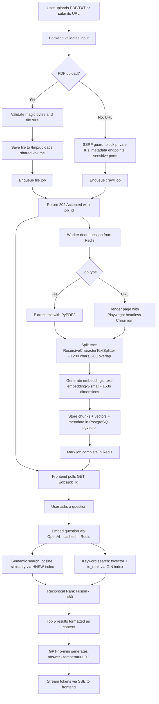

# RAG-Crawler

A multi-tenant Retrieval-Augmented Generation application that indexes user-uploaded documents and crawled web pages, then answers questions exclusively from that content using hybrid search and streaming LLM responses. Built as a five-container Docker system with full data isolation per user.

Live demo: https://ragcrawler.pgdev.com.br

---

## Architecture

RAG-Crawler runs as five Docker containers orchestrated by Docker Compose, sitting behind a Traefik reverse proxy for TLS termination and security headers.

**Frontend (Next.js 15)** serves the UI and proxies all `/api/*` requests to the backend via an internal Next.js rewrite, so the backend is never exposed to the public internet. Authentication is handled by Clerk, which issues JWTs verified by the backend using JWKS (RS256).

**Backend (FastAPI)** handles all business logic: JWT verification, rate limiting, file validation (including PDF magic bytes check against `%PDF-` header), SSRF-safe URL validation, and the RAG pipeline (hybrid search + LLM streaming). Uploaded files are saved to a shared Docker volume at `/tmp/uploads` so both the backend and worker containers can access them.

**Worker (RQ)** processes background jobs dequeued from Redis. It handles text extraction (PyPDF2 for PDFs, Playwright with headless Chromium for URLs), recursive text chunking, embedding generation via OpenAI, and vector storage in PostgreSQL. The worker shares the same codebase image as the backend.

**PostgreSQL 16 with pgvector** stores document chunks, their 1536-dimensional embedding vectors (HNSW-indexed), and a generated `tsvector` column (GIN-indexed) for full-text keyword search. Each user gets an isolated collection (`user_{clerk_id}`).

**Redis 7** serves as the job queue for RQ, the embedding cache (SHA256-keyed, 1-hour TTL), and transient storage for granular job progress updates that the frontend polls in real time.

The frontend is the only container on the Traefik `proxy` network. All five containers share an `internal` bridge network. PostgreSQL and Redis are not exposed to the host.

---

## Pipeline



**Ingestion stages:**

1. Input validation -- The backend checks file size (max 5MB), validates PDF files by inspecting the first 5 bytes for the `%PDF-` magic header, and runs SSRF checks on URLs (blocking private IPs, loopback, cloud metadata endpoints, and sensitive ports).
2. Background processing -- The job is enqueued in Redis and picked up by the RQ worker. The worker publishes granular progress steps (text extraction word count, chunk count, embedding progress, HNSW index confirmation) that the frontend polls and displays in real time.
3. Text extraction -- PDFs are parsed page-by-page with PyPDF2. URLs are rendered with headless Chromium via Playwright, which handles JavaScript-heavy pages and auto-expands collapsed sections.
4. Chunking -- LangChain's `RecursiveCharacterTextSplitter` splits text into 1200-character chunks with 200-character overlap, trying paragraph breaks first, then line breaks, then spaces.
5. Embedding and storage -- Each chunk is embedded with `text-embedding-3-small` (1536 dimensions) and stored in PostgreSQL with pgvector. An HNSW index (m=16, ef_construction=64) is built for vector search, and a GIN index on the generated `tsvector` column enables keyword search.

**Query stages:**

1. The question is embedded (with Redis caching) and two parallel searches run against the user's collection.
2. Results are merged with Reciprocal Rank Fusion and the top 5 are formatted into a context block.
3. GPT-4o-mini streams the answer token-by-token via SSE, with sources sent as the first event.

---

## Hybrid Search Algorithm

The system combines two complementary search strategies and merges their results with Reciprocal Rank Fusion.

**Semantic search** embeds the user's question into the same 1536-dimensional vector space as the stored document chunks, then finds the nearest neighbors using cosine similarity over the HNSW index. This captures meaning, synonyms, and paraphrases -- a query about "revenue growth" will match chunks discussing "increased sales" even though the words differ.

**Keyword search** uses PostgreSQL's built-in full-text search. A generated `tsvector` column stores the tokenized, stemmed form of each chunk. The query is converted to a `tsquery` and matched against this column, ranked by `ts_rank_cd`. This catches exact terms, acronyms, technical identifiers, and proper nouns that vector similarity tends to miss.

**Reciprocal Rank Fusion (RRF)** merges both result lists into a single ranked output. Each document receives a score of `1 / (k + rank)` from each search method where it appears (k=60, the standard value from the literature). Scores are summed across methods, and the final list is sorted by combined score. RRF is robust to score-scale differences between the two methods and consistently outperforms either method alone. The system fetches `3 * top_k` candidates from each method before fusion, then returns the top 5 after merging.

If keyword search returns no matches (common for very short or abstract queries), the system falls back to semantic-only results.

---

## Tech Stack

| Component | Technology | Role |
|---|---|---|
| Frontend | Next.js 15, React 19, TypeScript | SSR UI with standalone Docker build, API proxy via rewrites |
| UI | Radix UI, Tailwind CSS, Lucide Icons | Accessible components with utility-first styling |
| Authentication | Clerk | Managed auth with JWT (RS256), JWKS verification, social login |
| Backend | FastAPI, Python 3.11 | Async API with OpenAPI docs, JWT middleware, rate limiting |
| LLM | GPT-4o-mini via LangChain | Answer generation with conversation history (last 10 messages) |
| Embeddings | text-embedding-3-small | 1536-dimensional semantic vectors |
| Vector database | PostgreSQL 16 + pgvector | HNSW index for vector search, GIN index for full-text search |
| Job queue | Redis 7 + RQ | Background job processing with progress tracking |
| Web crawler | Playwright (headless Chromium) | JavaScript-rendered page extraction with SSRF protection |
| Rate limiting | slowapi | Per-user and per-IP request throttling |
| Reverse proxy | Traefik v3 | TLS termination via Let's Encrypt, HSTS, security headers |
| Containerization | Docker Compose | Five-service orchestration with health checks and resource limits |

---

## Getting Started

### Prerequisites

- Docker and Docker Compose
- An OpenAI API key with credits
- A Clerk application (free tier works)
- A domain with DNS pointing to your server (for HTTPS via Traefik)
- Traefik reverse proxy running with the `proxy` Docker network

### Environment Variables

Create a `.env` file in the project root with the following required variables:

| Variable | Description |
|---|---|
| `OPENAI_API_KEY` | OpenAI API key for embeddings and chat |
| `NEXT_PUBLIC_CLERK_PUBLISHABLE_KEY` | Clerk publishable key (starts with `pk_`) |
| `CLERK_SECRET_KEY` | Clerk secret key (starts with `sk_`) |
| `POSTGRES_PASSWORD` | PostgreSQL password (generate a strong random value) |

Optional variables:

| Variable | Default | Description |
|---|---|---|
| `CLERK_JWKS_URL` | Clerk API fallback | JWKS endpoint for JWT verification |
| `POSTGRES_USER` | `ragcrawler` | PostgreSQL username |
| `POSTGRES_DB` | `ragdb` | PostgreSQL database name |

The following are set automatically by `docker-compose.yml` and should not be overridden: `DATABASE_URL`, `REDIS_URL`, `CLERK_AUTHORIZED_PARTIES`, `NEXT_PUBLIC_API_URL`, `BACKEND_INTERNAL_URL`, `ENVIRONMENT`.

### Running with Docker

```bash
# Clone the repository
git clone <repository-url> /opt/showcase/RAG-Crawler
cd /opt/showcase/RAG-Crawler

# Create and fill .env
cp .env.example .env

# Build and start all five containers
docker compose up -d --build

# First build takes 5-10 minutes (Playwright installs Chromium, Next.js compiles)

# Verify all containers are healthy
docker compose ps

# Check backend health
docker exec ragcrawler-backend curl -s http://127.0.0.1:8000/health | python3 -m json.tool
```

---

## API Reference

All endpoints except `/` and `/health` require a valid Clerk JWT in the `Authorization: Bearer <token>` header.

| Method | Endpoint | Description |
|---|---|---|
| `GET` | `/` | API version info |
| `GET` | `/health` | Health check (database, Redis, worker, OpenAI status) |
| `GET` | `/auth/me` | Verify authentication, returns user ID |
| `POST` | `/ingest/upload` | Upload PDF or TXT file (max 5MB), returns `job_id` |
| `POST` | `/ingest/crawl` | Submit URL for crawling, returns `job_id` |
| `GET` | `/jobs/{job_id}` | Check background job status and progress steps |
| `GET` | `/chat/documents` | Get document count and upload limits |
| `POST` | `/chat/ask` | Ask a question (non-streaming response) |
| `POST` | `/chat/ask/stream` | Ask a question via SSE (token-by-token streaming) |
| `POST` | `/chat/reset` | Delete all indexed documents for current user |
| `POST` | `/analysis/search-comparison` | Run semantic, keyword, and hybrid search side-by-side |
| `GET` | `/analysis/embeddings-2d` | Get PCA 2D projection of all user embedding vectors |
| `POST` | `/admin/clear-data` | Clear all user data |

---

## Rate Limits

This deployment runs in showcase mode with intentional constraints:

| Constraint | Limit |
|---|---|
| Documents per user | 5 |
| File size | 5MB |
| Accepted formats | PDF, TXT |
| Inactivity auto-cleanup | 10 minutes |
| Upload/crawl rate | 10 per hour per user |
| Chat rate | 20 per minute per IP |
| Analysis (search comparison) | 20 per minute |
| Analysis (embeddings 2D) | 10 per minute |

The dashboard UX adapts in two phases: Phase 1 shows the upload interface when no documents exist, and Phase 2 switches to chat and analysis tabs with a collapsible upload panel once documents are indexed.
