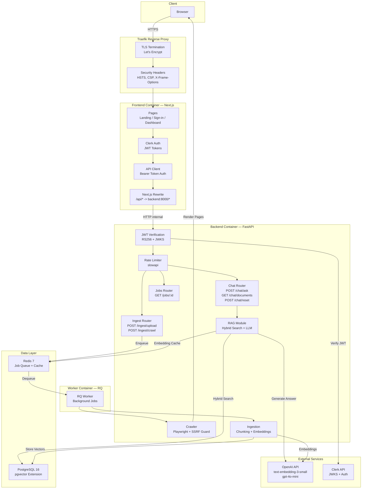
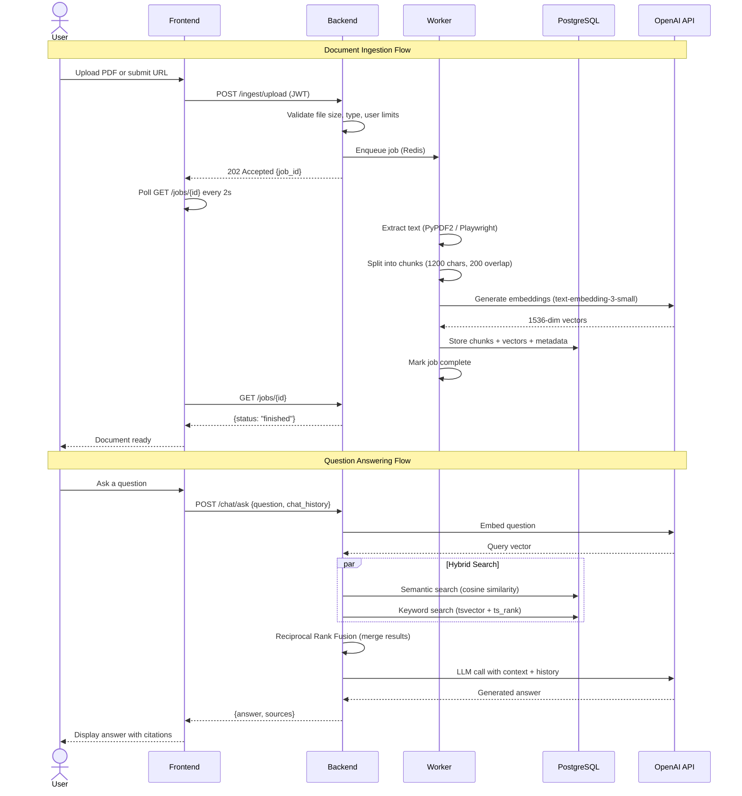

# RAG-Crawler

A multi-tenant Retrieval-Augmented Generation (RAG) application that lets users upload documents or crawl web pages, then ask questions answered exclusively from that indexed content. Built as a production-grade showcase of modern AI engineering practices.

**Live demo:** [ragcrawler.pgdev.com.br](https://ragcrawler.pgdev.com.br)

---

## Table of Contents

- [How It Works](#how-it-works)
- [Architecture](#architecture)
- [AI Pipeline](#ai-pipeline)
- [Tech Stack](#tech-stack)
- [API Reference](#api-reference)
- [Security](#security)
- [Project Structure](#project-structure)
- [Setup and Deployment](#setup-and-deployment)
- [Environment Variables](#environment-variables)

---

## How It Works

1. A user signs up via Clerk authentication
2. They upload PDF/TXT files or submit a URL to crawl
3. The system extracts text, splits it into chunks, generates vector embeddings, and stores everything in PostgreSQL with pgvector
4. When the user asks a question, a hybrid search (semantic + keyword) retrieves the most relevant chunks
5. The retrieved context and conversation history are sent to GPT-4o-mini, which generates an answer grounded exclusively in the user's documents
6. Each user's data is fully isolated and automatically cleaned up after 10 minutes of inactivity

---

## Architecture



### Request Flow



---

## AI Pipeline

### Document Processing

Documents go through a multi-stage pipeline before they can be queried:

1. **Text Extraction** -- PDF files are parsed with PyPDF2 (page by page). URLs are rendered with a headless Chromium browser via Playwright, which handles JavaScript-heavy pages and auto-expands collapsed sections.

2. **Chunking** -- The extracted text is split using LangChain's `RecursiveCharacterTextSplitter`. It recursively tries splitting on paragraph breaks, then line breaks, then spaces, preserving semantic boundaries. Each chunk is 1200 characters with 200 characters of overlap to prevent context loss at boundaries.

3. **Embedding** -- Each chunk is sent to OpenAI's `text-embedding-3-small` model, which returns a 1536-dimensional vector representing the semantic meaning of that text.

4. **Storage** -- Chunks, their vectors, and source metadata are stored in PostgreSQL using the pgvector extension. An HNSW index (m=16, ef_construction=64) enables fast approximate nearest-neighbor search. A GIN index on a generated `tsvector` column enables full-text keyword search.

### Hybrid Search

When a user asks a question, the system runs two parallel searches:

- **Semantic Search** -- The question is embedded into the same vector space and compared against stored chunks using cosine similarity. This finds conceptually related content even when different words are used.

- **Keyword Search** -- PostgreSQL's full-text search matches exact terms, acronyms, technical identifiers, and proper nouns that vector similarity might miss.

Results from both searches are combined using **Reciprocal Rank Fusion (RRF)** with k=60. Each document receives a score of `1/(k + rank)` from each search method, and scores are summed. This consistently outperforms either method alone.

### Answer Generation

The top 5 results are formatted into a context block and sent to GPT-4o-mini (temperature=0.1) along with the system prompt and the last 10 messages of conversation history. The system prompt strictly constrains the model to only answer from the provided context and cite its sources.

### Embedding Cache

Query embeddings are cached in Redis with a configurable TTL (default: 1 hour). The cache key is a SHA256 hash of the normalized query. This reduces OpenAI API calls for repeated or similar questions.

---

## Tech Stack

| Layer | Technology | Purpose |
|-------|-----------|---------|
| Frontend | Next.js 15, React 19, TypeScript | Server-side rendered UI with standalone build |
| UI Components | Radix UI, Tailwind CSS, Lucide Icons | Accessible component library with utility-first styling |
| Authentication | Clerk | Managed auth with JWT (RS256), social login support |
| Backend | FastAPI, Python 3.11 | Async API with automatic OpenAPI docs |
| LLM | GPT-4o-mini via LangChain | Answer generation with conversation memory |
| Embeddings | text-embedding-3-small (1536 dims) | Semantic vector representations |
| Vector Database | PostgreSQL 16 + pgvector | HNSW index for vector search, GIN index for full-text |
| Job Queue | Redis + RQ (Redis Queue) | Background processing with retry and backoff |
| Web Crawler | Playwright (headless Chromium) | JavaScript-rendered page content extraction |
| Rate Limiting | slowapi | Per-user and per-IP request throttling |
| Reverse Proxy | Traefik v3 | TLS termination, security headers, routing |
| Containerization | Docker Compose | Five-service orchestration with health checks |

---

## API Reference

All endpoints except `/` and `/health` require a valid Clerk JWT in the `Authorization: Bearer <token>` header.

| Method | Endpoint | Rate Limit | Description |
|--------|----------|-----------|-------------|
| `GET` | `/` | -- | API version info |
| `GET` | `/health` | -- | Health check (database, Redis, worker, OpenAI status) |
| `GET` | `/auth/me` | -- | Verify authentication, returns user ID |
| `POST` | `/ingest/upload` | 10/hour | Upload PDF or TXT file (max 5MB). Returns `job_id` |
| `POST` | `/ingest/crawl` | 10/hour | Submit URL for crawling. Returns `job_id` |
| `GET` | `/jobs/{job_id}` | -- | Check background job status |
| `GET` | `/chat/documents` | -- | Get document count and upload limits |
| `POST` | `/chat/ask` | 20/minute | Ask a question with optional chat history |
| `POST` | `/chat/reset` | -- | Delete all indexed documents for current user |
| `POST` | `/admin/clear-data` | -- | Clear all user data |

### Showcase Limits

This deployment runs in showcase mode with intentional constraints:

- Maximum 5 documents per user
- Maximum 5MB per file
- Accepted formats: PDF, TXT
- User data auto-deleted after 10 minutes of inactivity
- Upload rate: 10 per hour
- Chat rate: 20 questions per minute

---

## Security

### Authentication and Authorization

- Clerk-issued JWTs verified via JWKS (RS256 signature validation)
- Authorized party (`azp`) claim checked against configured whitelist
- Per-user data isolation via separate pgvector collections (`user_{clerk_id}`)
- Job ownership validation prevents cross-user data access

### Input Validation

- File size enforced server-side (5MB hard limit)
- Question length validated via Pydantic (1-2000 characters)
- URL crawling protected against SSRF: blocks private IPs, loopback addresses, cloud metadata endpoints (169.254.169.254), and sensitive ports (SSH, SMTP, database ports)

### Infrastructure

- HTTPS-only via Traefik with auto-renewed Let's Encrypt certificates
- Security headers: HSTS (1 year, preload), X-Frame-Options DENY, X-Content-Type-Options nosniff, strict Referrer-Policy, Permissions-Policy
- Backend CSP: `default-src 'none'; frame-ancestors 'none'`
- PostgreSQL and Redis on isolated Docker network (not exposed to host)
- Frontend runs as non-root user in container
- Connection pooling with pre-ping validation and 5-minute recycling
- Global exception handler suppresses stack traces in production

### Rate Limiting

- Upload and crawl: 10 requests per hour per user
- Chat: 20 requests per minute per IP
- Rate limit key falls back to IP address if JWT is invalid

---

## Project Structure

```
RAG-Crawler/
|-- docker-compose.yml              # 5-service orchestration
|-- .env                             # Secrets (not committed)
|
|-- backend/
|   |-- Dockerfile                   # Python 3.11 + Playwright
|   |-- requirements.txt
|   |-- app/
|       |-- main.py                  # FastAPI app, middleware, health check
|       |-- config.py                # Environment settings (Pydantic)
|       |-- database.py              # SQLAlchemy engine with connection pool
|       |-- schemas.py               # Request/response models
|       |-- security.py              # Auth dependency injection
|       |-- clerk_auth.py            # JWT verification via JWKS
|       |-- pgvector_store.py        # Vector DB, hybrid search, RRF
|       |-- rag.py                   # LLM pipeline with chat history
|       |-- crawler.py               # Playwright browser pool, SSRF guard
|       |-- ingestion.py             # PDF/TXT parsing, chunking
|       |-- tasks.py                 # RQ job definitions and queue
|       |-- background.py            # APScheduler for periodic cleanup
|       |-- user_activity.py         # Inactivity tracking and auto-cleanup
|       |-- embedding_cache.py       # Redis-backed embedding cache
|       |-- routers/
|           |-- auth.py              # GET /auth/me
|           |-- ingest.py            # POST /ingest/upload, /ingest/crawl
|           |-- chat.py              # POST /chat/ask, GET /chat/documents
|           |-- jobs.py              # GET /jobs/{job_id}
|           |-- admin.py             # POST /admin/clear-data
|
|-- frontend/
    |-- Dockerfile                   # Next.js standalone build
    |-- next.config.mjs              # API rewrite proxy to backend
    |-- middleware.ts                 # Clerk auth middleware
    |-- lib/
    |   |-- api.ts                   # API client with JWT and polling
    |-- app/
    |   |-- layout.tsx               # Root layout with ClerkProvider
    |   |-- page.tsx                 # Landing page
    |   |-- dashboard/page.tsx       # Protected dashboard
    |   |-- sign-in/page.tsx         # Clerk sign-in
    |   |-- sign-up/page.tsx         # Clerk sign-up
    |-- components/
        |-- dashboard-content.tsx    # Main dashboard state management
        |-- upload-section.tsx       # File upload and URL indexing
        |-- chat-section.tsx         # Chat interface with sources
        |-- ui/                      # Radix UI component library
```

---

## Setup and Deployment

### Prerequisites

- Docker and Docker Compose
- A Clerk application (free tier works)
- An OpenAI API key with credits
- A domain with DNS pointing to your server (for HTTPS)
- Traefik reverse proxy with the `proxy` Docker network

### 1. Clone and configure

```bash
git clone <repository-url> /opt/showcase/RAG-Crawler
cd /opt/showcase/RAG-Crawler
```

### 2. Set environment variables

```bash
cp .env.example .env   # if available, otherwise edit .env directly
```

Fill in the required values (see [Environment Variables](#environment-variables) below).

### 3. Deploy

```bash
docker compose up -d --build
```

The first build takes 5-10 minutes (Playwright installs Chromium, Next.js compiles).

### 4. Verify

```bash
# Check all containers are healthy
docker compose ps

# Check backend health
docker exec ragcrawler-backend curl -s http://127.0.0.1:8000/health | python3 -m json.tool

# Verify SSL certificate
echo | openssl s_client -connect ragcrawler.pgdev.com.br:443 2>/dev/null | openssl x509 -noout -subject -issuer

# Verify security headers
curl -sI https://ragcrawler.pgdev.com.br | grep -iE "strict-transport|x-frame|x-content"
```

---

## Environment Variables

All variables are set in the root `.env` file and consumed by Docker Compose.

### Required

| Variable | Description |
|----------|-------------|
| `OPENAI_API_KEY` | OpenAI API key for embeddings and chat |
| `NEXT_PUBLIC_CLERK_PUBLISHABLE_KEY` | Clerk publishable key (starts with `pk_`) |
| `CLERK_SECRET_KEY` | Clerk secret key (starts with `sk_`) |
| `POSTGRES_PASSWORD` | PostgreSQL password (generate a strong random value) |

### Optional

| Variable | Default | Description |
|----------|---------|-------------|
| `CLERK_JWKS_URL` | Clerk API fallback | JWKS endpoint for JWT verification |
| `POSTGRES_USER` | `ragcrawler` | PostgreSQL username |
| `POSTGRES_DB` | `ragdb` | PostgreSQL database name |

### Set by Docker Compose (do not override)

These are configured in `docker-compose.yml` and should not be changed in `.env`:

| Variable | Value | Description |
|----------|-------|-------------|
| `DATABASE_URL` | Built from PG vars | PostgreSQL connection string |
| `REDIS_URL` | `redis://redis:6379/0` | Redis connection |
| `CLERK_AUTHORIZED_PARTIES` | `https://ragcrawler.pgdev.com.br` | JWT authorized party validation |
| `NEXT_PUBLIC_API_URL` | `/api` | Frontend API base URL (proxied to backend) |
| `BACKEND_INTERNAL_URL` | `http://backend:8000` | Internal backend URL for Next.js rewrites |
| `ENVIRONMENT` | `production` | Enables JSON logging, hides error details |

---

## License

This project is a portfolio showcase. All rights reserved.
